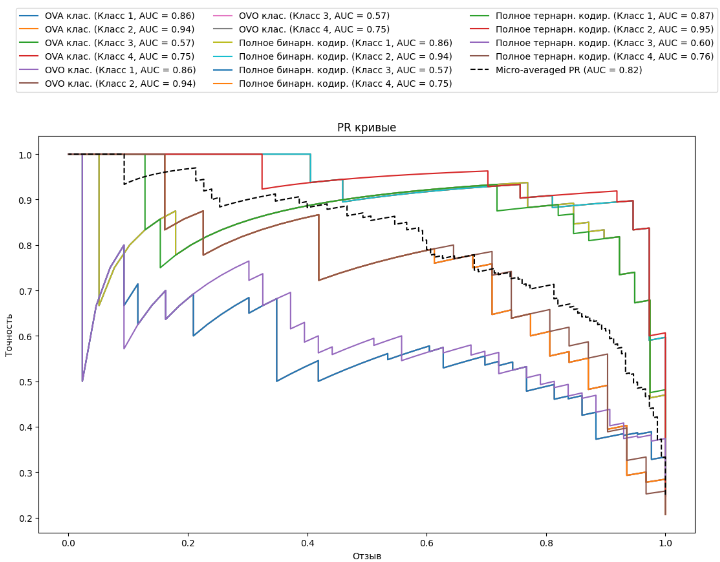

# Лабораторные работы в этом репозитории представлены, для курса ML в университете НИЯУ МИФИ.

---

В качестве датасета будет рассматриваться простой датасет из координат (X,Y), которые имеют вещественный вид. В ходе выполнения данных работ был сформирован навык обработки данных и их визуализации.

---

### Обзор датасета

Обзор датасета и обучение лнейных моделй по OLS, WLS, а также визуализация, вычисления представлены в файле [ML_1_6](https://github.com/QuanRy/ML_MiFi/blob/main/lab_1/ML_1_6.ipynb). ВЫ также можете просмотреть результат, а также сам ход вычислений.

Просмотрим, что лежит в нашем датасете:

  
  
 Рисунок 1 – Пример содержания датасета 
 

Далее построим графики лнейной регрессии и доверительных интервалов:

  
  
 Рисунок 2 – График линейной регрес на исходных данных датасета 
 

  
  
 Рисунок 3 – График доверительных интервалов и линейной регрессии на исходных данных 
 

### Регрессионная модель по OLS

Просмотрим зависимость остатков

  
  
 Рисунок 4 – Зависимость остатков от моделируемых значений 
 

  
  
 Рисунок 5 – График остатков моделии OLS 
 

---

### Регрессионная модель по WLS

  
  
 Рисунок 6 – График остатков моделии WLS 
 

Сравним результаты моделей OLS и WLS, полученных на нашем наборе данных

  
  
 Рисунок 7 – График сравнения регрессионных моделей OLS и WLS 
 

---

### Рассеяние

Анализ рассеяния, знакомство с байесовскими бинарными классификаторами при различных способах ECOC-кодирования, а также визуализация, вычисления представлены в файле [ML_2_6](https://github.com/QuanRy/ML_MiFi/blob/main/lab_2/ML_2_6.ipynb). ВЫ также можете просмотреть результат, а также сам ход вычислений.

Рассеяние (variance) — это мера того, насколько сильно предсказания модели изменяются при обучении на разных наборах данных.

  
  
 Рисунок 8 – График рассеяния 
 

  
  
 Рисунок 9 – Гистограмма X1, X2 по классам 
 

---

### Байесовские бинарные классификаторы при различных способах ECOC-кодирования

В качестве рассматриваемых байесовских бинарных классификаторов при различных способах ECOC-кодирования рассмотрим следующие: 

##### а) OVA; 

##### б) OVO; 

##### в) полное бинарное кодирование; 

##### г) полное тернарное кодирование.

В результате были получены следующие метрки (OVA, OVO на срине, больше в [файле](https://github.com/QuanRy/ML_MiFi/blob/main/lab_2/ML_2_6.ipynb)):

  
  
 Рисунок 10 – Полученные данные по различным классификаторам 
 

 

  
  
 Рисунок 11 – График OVA классификаци 
 

 

Ну, в качестве еще одного показателя нашей работы приведем ROC и PR-кривые.

  
  
 Рисунок 12 – График ROC-кривой 
 

 

  
  
 Рисунок 13 – График PR-кривой 
 

 
